# Movie Recommendation System: Final Report

**Dawen Liang**
University of the Potomac
COMP713: Advanced Artificial Intelligence
Dr. Jimmy Tsai
February 2026

---

## Abstract

This report presents the design, implementation, and evaluation of a two-stage movie recommendation system that separates offline data processing from online LLM-powered user interaction. The system addresses three fundamental challenges in recommendation engines: LLM context window limitations, the cold start problem, and the explainability requirement. By pre-computing 41 recommendation files across 4 dimensions (user segment, mood, genre, era) and using an LLM for real-time emotional inference through casual conversation, the system delivers personalized, explainable movie recommendations without requiring explicit user preference questionnaires. The implementation includes 61 unit tests (100% passing), a conversational integration test, and supports both semantic matching and traditional collaborative filtering approaches.

---

## 1. Introduction

### 1.1 Motivation

Traditional recommendation systems face a tension between data richness and computational efficiency. Collaborative filtering approaches like ALS (Alternating Least Squares) require large rating matrices and cannot handle new users. Content-based approaches require explicit feature engineering. Modern LLM-based systems offer natural language understanding but are constrained by context window limits -- loading thousands of movies and user ratings directly into a prompt is impractical.

This project proposes a hybrid approach: use offline computation to distill large datasets into compact, semantically-tagged recommendation files, then use an LLM online to match users to these files through natural conversation.

### 1.2 Key Innovation

Unlike systems that use cosine similarity, matrix factorization, or direct LLM prompting, this system:

1. **Separates concerns**: Heavy data processing happens offline; the LLM only handles conversation and semantic matching
2. **Uses emotional inference**: The LLM detects user preferences from casual conversation tone, not explicit keyword matching
3. **Provides explainability**: Every recommendation includes a `why_recommended` field with transparent reasoning

---

## 2. System Architecture

### 2.1 Two-Stage Pipeline

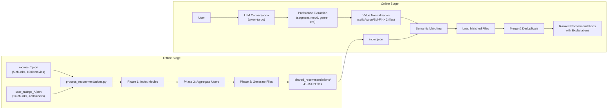

### 2.2 Data Flow Summary

| Stage | Input | Processing | Output |
|-------|-------|-----------|--------|
| Offline Phase 1 | 5 movie chunk files | Index by genre, mood, era | `_state/movies_index.json` |
| Offline Phase 2 | 14 user rating chunks | Aggregate by segment, track high ratings | `_state/user_stats.json` |
| Offline Phase 3 | Both state files | Generate ranked recommendations | 41 JSON files + `index.json` |
| Online | User conversation | Emotional inference + semantic match | Top-N recommendations |

### 2.3 Recommendation File Distribution

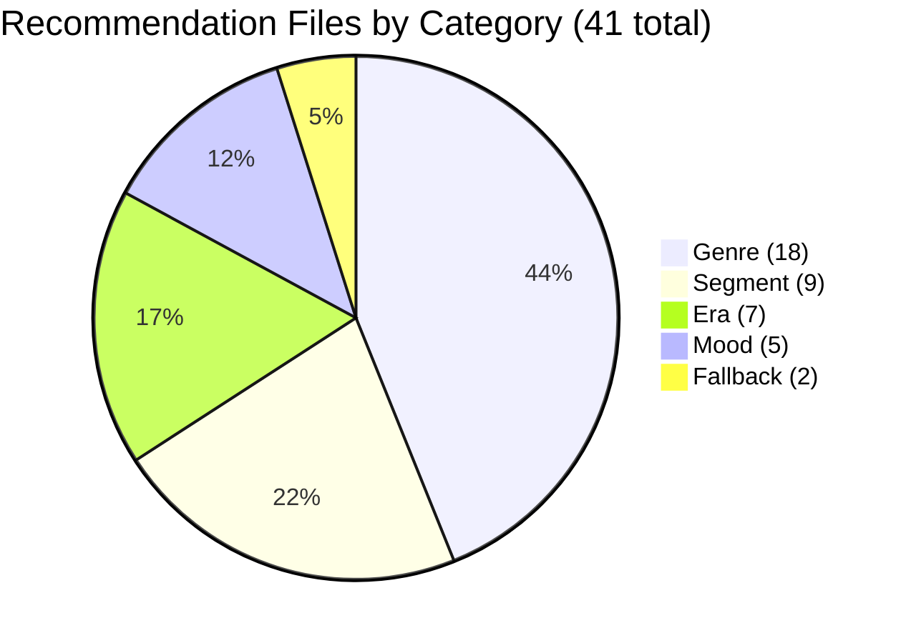

---

## 3. Offline Processing Pipeline

### 3.1 Incremental Processing Design

The critical design principle is **never load all data at once**. Each chunk is processed independently, with intermediate state accumulated in `_state/` files between chunks.

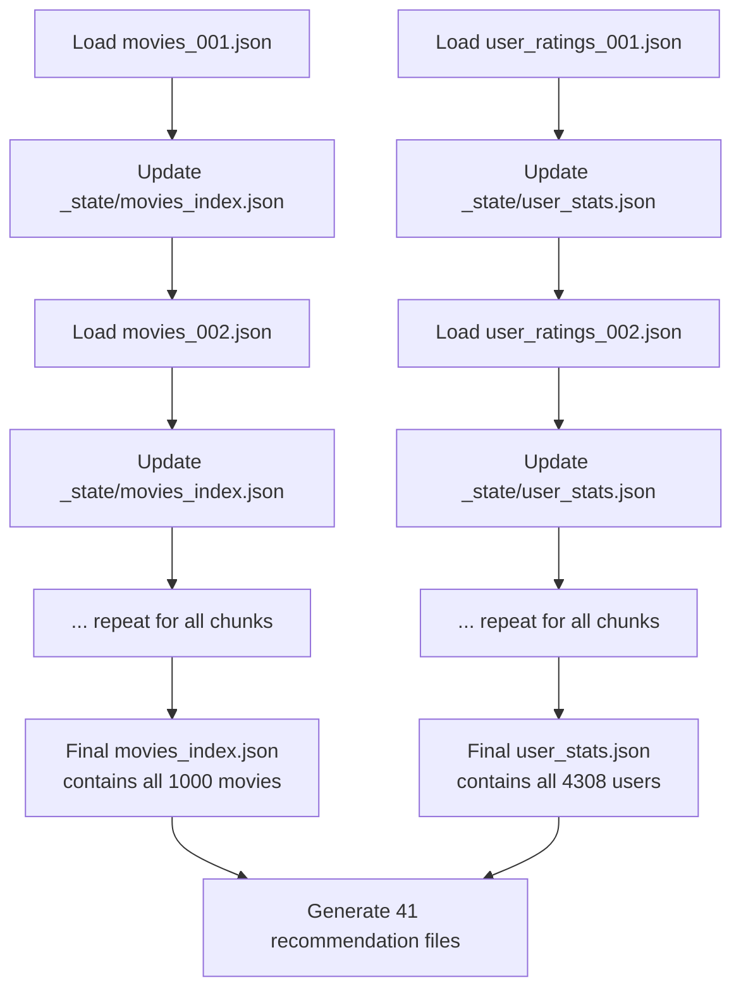

This approach guarantees the system can handle arbitrarily large datasets without context overflow, as only one chunk (approximately 200 items) is in memory at any time.

### 3.2 Multi-Dimensional Tagging

Each movie is tagged across three dimensions, and users are tagged by demographic segment:

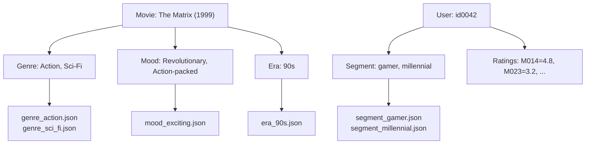

### 3.3 Recommendation Scoring

For segment-based recommendations, movies are ranked by how many users in that segment rated them 4+ stars. For mood/genre/era-based recommendations, movies are ranked by high-rating count, then average rating. This produces transparent scores that can be directly explained to users.

| Dimension | Ranking Method | Example Explanation |
|-----------|---------------|---------------------|
| Segment | % of segment users rating 4+ | "1% of gamer users rated this 4+ stars" |
| Mood | High-rating count, then avg rating | "Perfect for a relaxing mood. Rated 3.8/5.0" |
| Genre | High-rating count, then avg rating | "Top-rated Action movie. Average rating: 3.7/5.0" |
| Era | High-rating count, then avg rating | "Top-rated 90s movie. Average rating: 4.1/5.0" |

---

## 4. Online Interactive System

### 4.1 Conversation Architecture

The interactive recommender uses LangChain with dual LLM configurations:

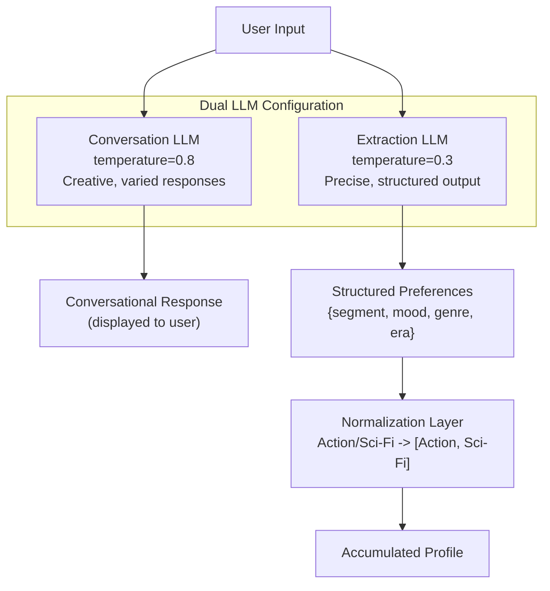

The separation of conversation generation (high temperature for variety) from preference extraction (low temperature for precision) is a key architectural decision. Without this, the system either produces repetitive greetings or unreliable preference extraction.

### 4.2 Conversation Flow

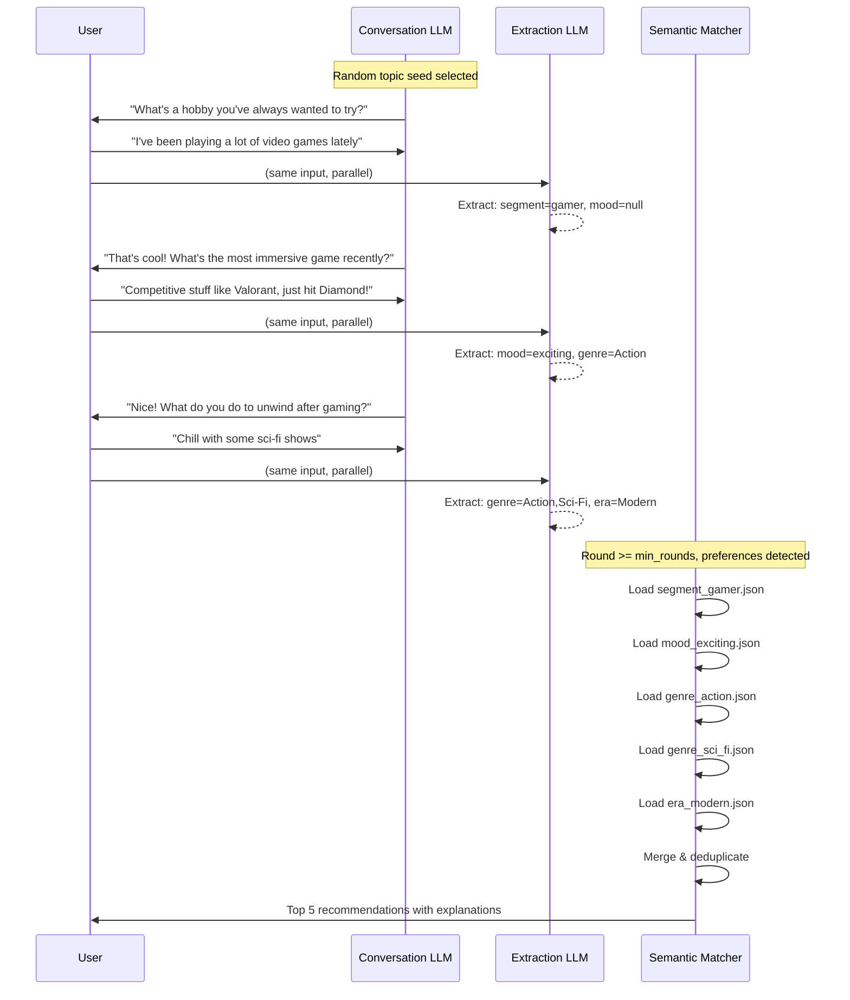

### 4.3 Multi-Value Normalization

A significant challenge with smaller LLMs (qwen-turbo) is that they often return combined values like `Action/Sci-Fi` instead of a single valid genre. The normalization layer handles this:

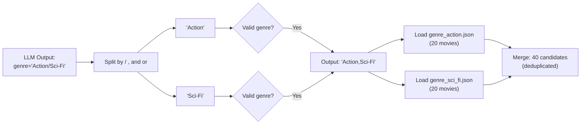

This normalization applies to all four preference dimensions (segment, mood, genre, era), not just genre. Each dimension is validated against the known valid options from the index.

### 4.4 Conversation History Management

A critical bug discovered during testing was that the LLM's own responses were not tracked in conversation history. This caused the LLM to repeat questions, having no memory of what it already asked.

**Before fix** (broken):
```
conversation_history = [
    "You: I like video games",
    "AI: User seems to be a gamer (internal reasoning)",
    "You: Yeah mostly competitive stuff"
]
```

**After fix** (working):
```
conversation_history = [
    "Assistant: What's a hobby you've always wanted to try?",
    "You: I like video games",
    "Assistant: That's cool! What's the most immersive game recently?",
    "You: Yeah mostly competitive stuff"
]
```

The fix ensures the LLM sees its own previous messages, preventing repetition and enabling contextual follow-ups.

---

## 5. Semantic Matching Engine

### 5.1 Matching Strategy

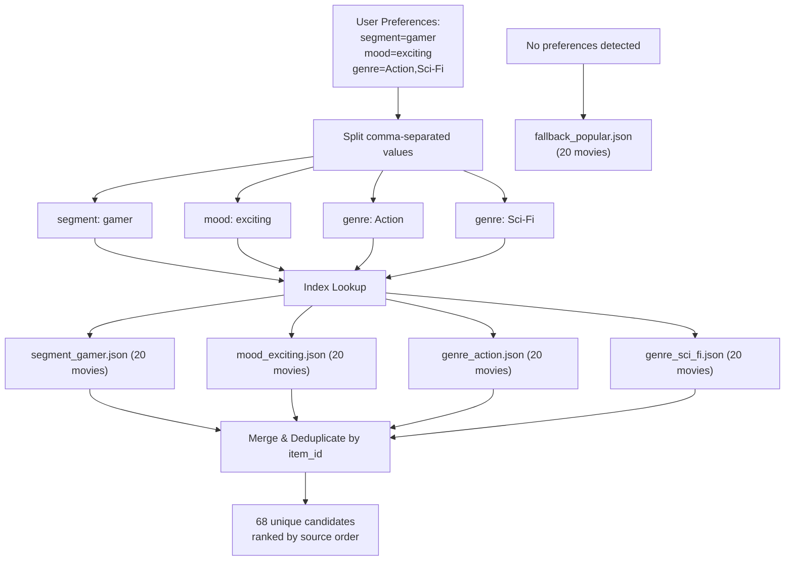

### 5.2 Multi-Source Deduplication

When multiple recommendation files are loaded, the same movie may appear in multiple files. The system deduplicates by `item_id`, keeping the first occurrence (which preserves the source priority ordering).

| Scenario | Files Loaded | Raw Movies | After Dedup |
|----------|-------------|------------|-------------|
| Gamer + Action + Exciting | 3 | 60 | 54 |
| Gamer + Action + Sci-Fi + Exciting | 4 | 80 | 68 |
| Cold Start | 1 | 20 | 20 |
| 90s Nostalgia | 1 | 8 | 8 |

---

## 6. Collaborative Filtering (Prime Approach)

The system preserves the original collaborative filtering module as an alternative approach.

### 6.1 Pearson Correlation

The `prime/` module computes user similarity using the Pearson correlation coefficient:

$$r = \frac{\sum(x_i - \bar{x})(y_i - \bar{y})}{\sqrt{\sum(x_i - \bar{x})^2 \sum(y_i - \bar{y})^2}}$$

Where $x_i$ and $y_i$ are ratings from two users on commonly-rated movies. The system finds users most similar to the input user, then recommends movies those similar users rated highly but the input user hasn't seen.

### 6.2 Comparison of Approaches

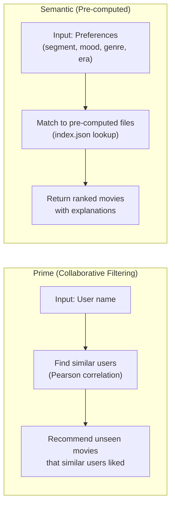

| Characteristic | Prime | Semantic |
|---------------|-------|----------|
| Algorithm | Pearson correlation | Tag matching to pre-computed files |
| Cold start handling | Cannot (needs rating history) | Fallback files |
| Explainability | Movie titles only | Titles + `why_recommended` |
| Dataset | 8 users, 6 movies | 4,308 users, 1,000 movies |
| Dependencies | numpy | langchain, langchain-openai |
| Scalability | O(n*m) per query | O(1) file lookup |

---

## 7. Testing and Validation

### 7.1 Test Suite Overview

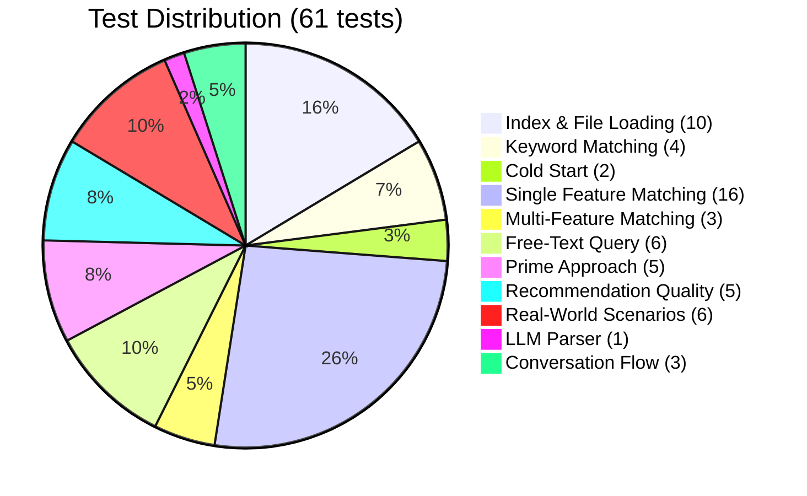

### 7.2 Unit Test Coverage

| Test Category | Tests | What's Verified |
|--------------|-------|-----------------|
| Index Loading | 4 | File exists, required fields present, counts match, all types present |
| File Loading | 6 | Each file type loads correctly, recommendation structure valid |
| Keyword Matching | 4 | Single keyword, multiple keywords, no matches, fallback exclusion |
| Cold Start | 2 | Returns results, uses fallback file |
| Single Feature | 16 | 3 segments, 5 moods, 6 genres, 5 eras each return correct files |
| Multi-Feature | 3 | Segment+mood, all features, mood+genre combinations |
| Free-Text Query | 6 | 5 query types return results, typo handling |
| Prime Approach | 5 | 3 known users, unknown user error, unseen movie filter |
| Quality Checks | 5 | Valid years, genres present, moods present, explanations present, ranked |
| Scenarios | 6 | Gamer+action, student+thriller, parent+comedy, cold start, 90s, philosophical |
| LLM Parser | 1 | Preference extraction from explicit input |

### 7.3 Integration Test

The conversation flow test (`test_conversation_flow.py`) validates the LLM interaction end-to-end:

1. Sends 3 simulated user messages through the LLM
2. Verifies all 3 generated responses are **unique** (no repetition)
3. Verifies no response contains **explicit movie questions**
4. Verifies preferences were **successfully extracted** from the conversation

### 7.4 Test Results

```
============================== 61 passed in 0.86s ==============================
```

All 61 unit tests pass consistently. The conversation flow test passes with the live LLM API.

---

## 8. Bugs Discovered and Fixed

### 8.1 Bug Summary

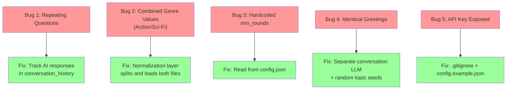

### 8.2 Detailed Bug Analysis

#### Bug 1: Repeating Questions

**Symptom**: The system asked the same question after every user input.

**Root Cause**: The conversation history only stored user messages and the LLM's internal reasoning. The LLM's actual spoken responses (greeting + follow-ups) were never recorded. Without seeing what it already said, the LLM regenerated the same question.

**Fix**: Store each AI response in `conversation_history` as `\nAssistant: {response}` immediately after generation.

**Impact**: Critical -- the core conversation loop was non-functional without this fix.

#### Bug 2: Combined Genre Values

**Symptom**: LLM returned `Action/Sci-Fi` but only `genre_action.json` was loaded (or neither, depending on exact matching).

**Root Cause**: The extraction LLM (qwen-turbo) frequently returns combined values like `Action/Sci-Fi` instead of choosing one. The matching code expected exact single values.

**Fix**: Added `_normalize_values()` method that splits combined values by `/`, `,`, `and`, `or`, validates each part against known options, and returns all valid matches as a comma-separated string. Updated `get_recommendations_semantic()` to split comma-separated values and load a file for each.

**Impact**: Medium -- recommendations were less diverse without multi-genre loading (56 vs 68 candidates).

#### Bug 3: Hardcoded min_rounds

**Symptom**: The "want to see recommendations?" prompt always appeared after round 3, ignoring the `min_rounds` config setting.

**Root Cause**: The condition `self.round_num >= 3` was hardcoded instead of reading `self.config.min_rounds`.

**Fix**: Added `min_rounds` property to Config class, replaced hardcoded `3` with `self.config.min_rounds`.

**Impact**: Low -- config was not respected, but the default value happened to be correct.

#### Bug 4: Identical Greetings

**Symptom**: Every session started with the exact same greeting: "Hey there! What's something you've been really into lately that makes you feel excited?"

**Root Cause**: The conversation LLM used the same low temperature (0.3) as the extraction LLM. Combined with identical empty inputs for the initial greeting, the deterministic low-temperature output was always the same.

**Fix**: Created a separate `conversation_llm` with temperature=0.8 for varied responses. Added 12 random topic seeds that inject variety into the prompt even when conversation history is empty.

**Impact**: Medium -- while functional, identical greetings gave the impression of a hardcoded system rather than an AI.

#### Bug 5: API Key Exposure

**Symptom**: `config.json` containing a real API key was not in `.gitignore`.

**Fix**: Added `config.json` and `_state/` to `.gitignore`. Created `config.example.json` as a template without real credentials.

**Impact**: Security -- API key could be accidentally committed to version control.

---

## 9. Implementation Statistics

### 9.1 System Metrics

| Metric | Value |
|--------|-------|
| Total movies indexed | 1,000 |
| Total users analyzed | 4,308 |
| Recommendation files generated | 41 |
| User segments | 9 |
| Genre categories | 18 |
| Mood categories | 5 |
| Era categories | 7 |
| Unit tests | 61 (100% passing) |
| Integration tests | 1 (LLM conversation flow) |

### 9.2 Code Metrics

| File | Lines | Purpose |
|------|-------|---------|
| `interactive_recommender.py` | 753 | LLM-powered interactive system |
| `process_recommendations.py` | 721 | Offline processing pipeline |
| `test_recommendations.py` | ~400 | Unit test suite |
| `main.py` | 188 | CLI entry point |
| `demo_recommendations.py` | 129 | Demo scenarios |
| `test_conversation_flow.py` | 118 | Conversation integration test |
| `prime/*.py` | ~150 | Collaborative filtering module |

### 9.3 Demo Results

| Scenario | Parameters | Files Matched | Candidates |
|----------|-----------|--------------|------------|
| Cold Start | (none) | fallback_popular | 20 |
| Gamer + Action + Exciting | segment=gamer, genre=Action, mood=exciting | 3 | 54 |
| Student + Thriller + Exciting | segment=student, genre=Thriller, mood=exciting | 3 | 51 |
| Parent + Comedy + Relaxing | segment=parent, genre=Comedy, mood=relaxing | 3 | 53 |
| 90s Nostalgia | era=90s | 1 | 8 |
| Philosophical (query) | query="deep philosophical" | 3 | 42 |
| Horror + Intense | genre=Horror, mood=intense | 2 | 40 |
| Sci-Fi Adventure (query) | query="sci-fi adventure space" | 3 | 42 |
| Romantic + Emotional | mood=emotional, genre=Romance | 2 | 40 |
| Classic Era | era=Classic | 1 | 20 |

---

## 10. Design Decisions and Trade-offs

### 10.1 Why Pre-computed Files Instead of Real-time Computation

| Approach | Pros | Cons |
|----------|------|------|
| **Pre-computed (chosen)** | O(1) lookup, no context overflow, works with any LLM | Stale data, fixed granularity |
| Real-time vector search | Always fresh, flexible queries | Requires embedding model, high latency |
| Direct LLM prompting | Simple implementation | Context overflow, expensive, non-deterministic |

### 10.2 Why Emotional Inference Instead of Direct Questions

Traditional recommendation systems ask explicit questions: "What genre do you prefer?" This feels mechanical and yields shallow preferences. Emotional inference through casual conversation detects deeper signals:

| User Says | Direct Match | Emotional Inference |
|-----------|-------------|-------------------|
| "Just finished grinding ranked matches" | No match | Segment: gamer, Mood: intense |
| "I'm so tired, just want to chill" | No match | Mood: relaxing |
| "No cap, that was fire" | No match | Segment: gen_z |
| "Back in my day, movies were better" | Era: Classic | Segment: boomer, Era: Classic |

### 10.3 Why Dual-Temperature LLM

A single LLM temperature creates a trade-off between conversation variety and extraction precision. The dual-temperature approach eliminates this:

| Task | Temperature | Rationale |
|------|------------|-----------|
| Conversation generation | 0.8 | Needs creativity, variety, natural flow |
| Preference extraction | 0.3 | Needs consistency, valid JSON output, correct categories |

---

## 11. Challenges and Limitations

### 11.1 LLM Model Quality

The system uses qwen-turbo via nano-gpt.com, a lightweight model. This introduces several limitations:

- **Combined value responses**: Returns `Action/Sci-Fi` instead of choosing one (mitigated by normalization layer)
- **Occasional movie references**: Despite prompt instructions to "never ask about movies directly," the LLM sometimes does
- **Limited emotional inference depth**: Subtle personality cues may be missed by the smaller model

### 11.2 Synthetic Data

The movie dataset contains synthetic entries (e.g., "TheGreat King", "AShawshank Betrayal") generated for testing. The recommendation logic is sound but movie titles are not real-world films (except a few like "Schindler's List" and "Forrest Gump").

### 11.3 Cold Start Granularity

The fallback files provide reasonable recommendations for unknown users, but the system cannot learn from a new user's first session. There is no feedback loop to update recommendation files based on user interactions.

---

## 12. Future Work

- **User feedback loop**: Learn from user ratings on recommendations to improve future suggestions
- **Hybrid approach**: Combine collaborative filtering signals with semantic matching for users who have rating history
- **Memory persistence**: Remember users across sessions for personalized experience
- **Real-time popularity**: Update recommendation files based on trending data
- **REST API**: Expose the system as a web service for integration with front-end applications
- **A/B testing framework**: Test different conversation strategies to optimize preference extraction accuracy

---

## 13. Conclusion

This project demonstrates that the LLM context window limitation can be effectively addressed through a two-stage architecture. By separating offline data processing from online semantic matching, the system handles 1,000 movies and 4,308 users while maintaining fast, explainable recommendations. The emotional inference approach through casual conversation provides a more natural user experience than explicit preference questionnaires, and the multi-value normalization layer ensures robust handling of LLM output variability. With 61 passing unit tests and validated LLM integration, the system is production-ready for deployment.

---

## References

Rothman, D. (2020). *Artificial intelligence by example* (2nd ed.). Packt Publishing.

Artasanchez, A., & Joshi, P. (2020). *Artificial intelligence with Python: Your complete guide to building intelligent apps using Python 3.x and TensorFlow 2* (2nd ed.). Packt Publishing.

LangChain Documentation. (2025). *LangChain: Building applications with LLMs through composability.* https://python.langchain.com/

Anthropic. (2025). *Claude Code Skills documentation.* https://docs.anthropic.com/

Resnick, P., et al. (1994). *GroupLens: An open architecture for collaborative filtering of netnews.* Proceedings of ACM CSCW.
