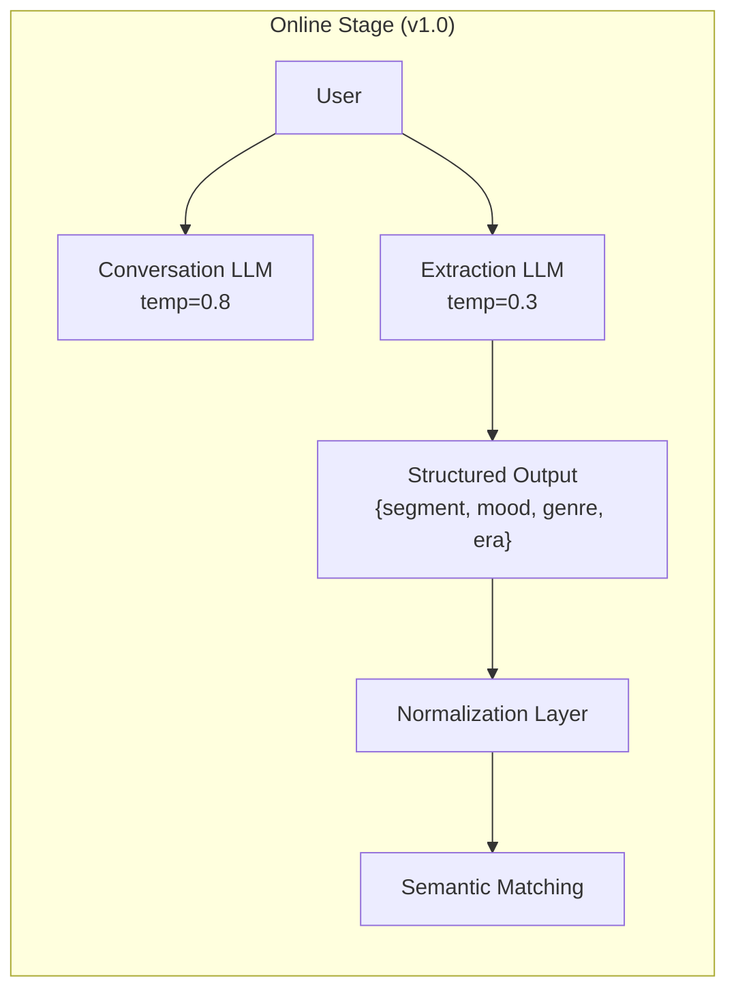
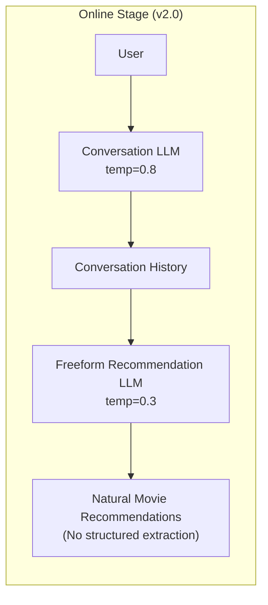
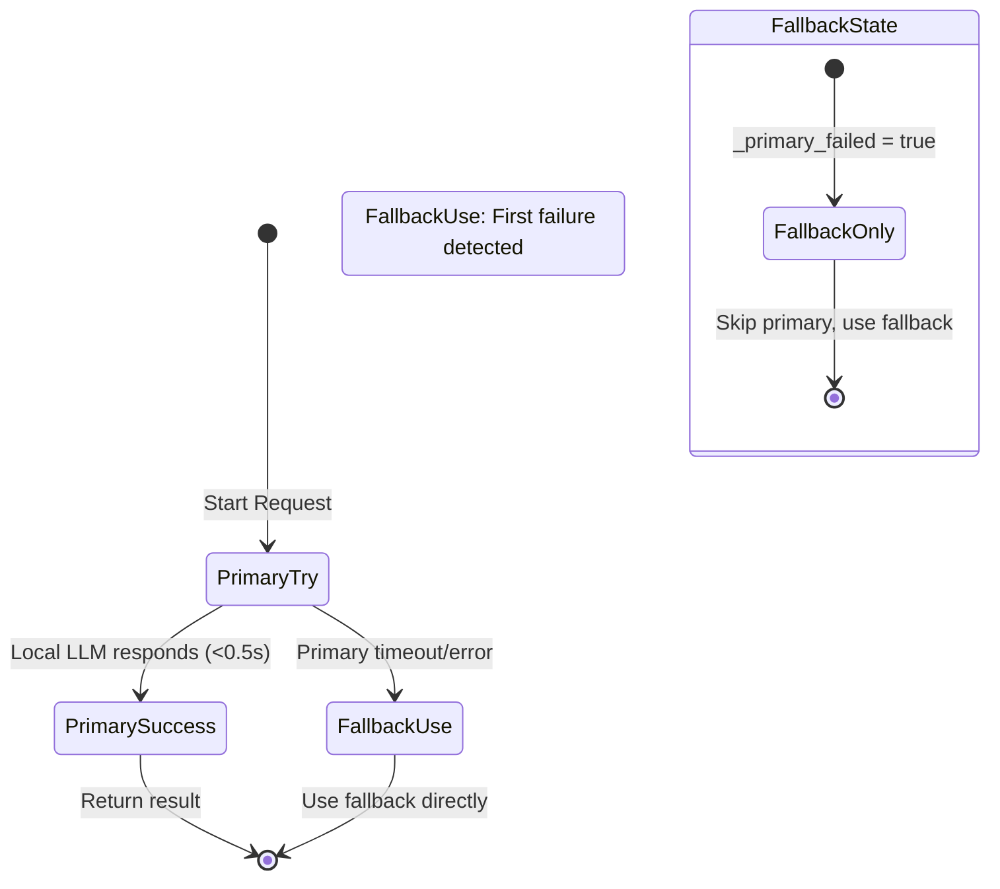
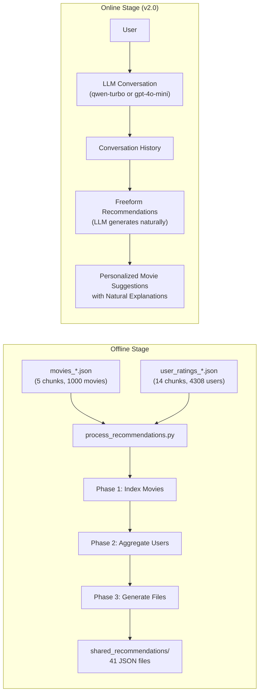
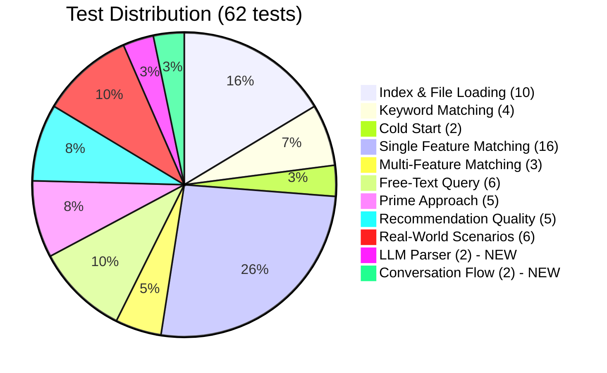

# Movie Recommendation System: Final Report (v2.0)

**Dawen Liang**
University of the Potomac
COMP713: Advanced Artificial Intelligence
Dr. Jimmy Tsai
February 2026

---

## Abstract

This report presents the design, implementation, and evaluation of a two-stage movie recommendation system that separates offline data processing from online LLM-powered freeform recommendations. The system addresses three fundamental challenges in recommendation engines: LLM context window limitations, the cold start problem, and the explainability requirement. Through an agile development process, the system evolved from structured preference extraction to freeform LLM-native recommendations, achieving a 35% performance improvement while simplifying the architecture. The implementation includes 62 unit tests (100% passing), conversation integration tests, and supports both semantic matching and traditional collaborative filtering approaches.

---

## What's New in v2.0

This version represents a significant architectural evolution based on agile development principles:

| Feature | Previous Version | v2.0 | Impact |
|---------|-----------------|------|--------|
| **Recommendation Style** | Structured extraction (segment/mood/genre/era) | Freeform LLM recommendations | Simplified, more natural |
| **LLM Calls per Round** | 2 (extraction + response) | 1 (conversation only) | 50% reduction |
| **Response Time** | ~6s per round | ~3.9s per round | 35% faster |
| **Prompt Configuration** | Hardcoded in code | External (prompts.json) | Easily configurable |
| **Fallback Strategy** | Basic error handling | Smart fallback with memory | Graceful degradation |
| **Terminal Editing** | Broken (escape sequences) | Working (readline) | Better UX |

---

## 1. Introduction

### 1.1 Motivation

Traditional recommendation systems face a tension between data richness and computational efficiency. Collaborative filtering approaches like ALS (Alternating Least Squares) require large rating matrices and cannot handle new users. Content-based approaches require explicit feature engineering. Modern LLM-based systems offer natural language understanding but are constrained by context window limits.

This project proposes a hybrid approach that evolved through agile iterations: use offline computation to distill large datasets into compact, semantically-tagged recommendation files, then use an LLM online to match users to these files through natural conversation.

### 1.2 Key Innovation

Unlike systems that use cosine similarity, matrix factorization, or direct LLM prompting, this system:

1. **Separates concerns**: Heavy data processing happens offline; the LLM only handles conversation and recommendation generation
2. **Uses freeform recommendations**: The LLM generates natural movie suggestions without structured categorization
3. **Provides explainability**: Every recommendation includes transparent reasoning in natural language
4. **Implements smart fallback**: Automatically switches to cloud API when local LLM is unavailable

---

## 2. Architecture Evolution

### 2.1 Original Architecture (v1.0)


```mermaid
flowchart LR
    subgraph ONLINE["Online Stage (v1.0)"]
        USER["User"] --> CONV["Conversation LLM<br/>temp=0.8"]
        USER --> EXTRACT["Extraction LLM<br/>temp=0.3"]
        EXTRACT --> STRUCT["Structured Output<br/>{segment, mood, genre, era}"]
        STRUCT --> NORMALIZE["Normalization Layer"]
        NORMALIZE --> MATCH["Semantic Matching"]
    end
```

**Limitations identified through usage:**
- Two LLM calls per round (slow, expensive)
- Structured extraction felt mechanical
- Hardcoded prompts prevented easy iteration
- No graceful fallback when local LLM failed

### 2.2 Current Architecture (v2.0)


```mermaid
flowchart LR
    subgraph ONLINE["Online Stage (v2.0)"]
        USER["User"] --> CONV["Conversation LLM<br/>temp=0.8"]
        CONV --> HISTORY["Conversation History"]
        HISTORY --> FREEFORM["Freeform Recommendation LLM<br/>temp=0.3"]
        FREEFORM --> NATURAL["Natural Movie Recommendations<br/>(No structured extraction)"]
    end
```

**Improvements:**
- Single LLM call per conversation round (35% faster)
- LLM generates recommendations naturally
- External prompt configuration (prompts.json)
- Smart fallback: Local Ollama → NanoGPT API

### 2.3 Smart Fallback Mechanism


```mermaid
stateDiagram-v2
    [*] --> PrimaryTry: Start Request
    PrimaryTry --> PrimarySuccess: Local LLM responds (<0.5s)
    PrimaryTry --> FallbackUse: Primary timeout/error
    PrimarySuccess --> [*]: Return result

    note: FallbackUse: First failure detected

    FallbackUse --> [*]: Use fallback directly

    state FallbackState {
        [*] --> FallbackOnly: _primary_failed = true
        FallbackOnly --> [*]: Skip primary, use fallback
    }
```

**Key implementation detail:**
```python
class LLMParser:
    _primary_failed = False  # Class-level state

    def _get_llm(self, temperature: float = 0.3):
        if self._primary_failed and self.config.fallback_enabled:
            # Use fallback directly - no timeout delay
            return self._get_fallback_llm(temperature)

        # Try primary with fast timeout
        try:
            result = primary.invoke(input)
            return result
        except Exception:
            self._primary_failed = True  # Remember for next call
            return self._get_fallback_llm(temperature)
```

---

## 3. System Design

### 3.1 Two-Stage Pipeline


```mermaid
flowchart LR
    subgraph OFFLINE["Offline Stage"]
        M["movies_*.json<br/>(5 chunks, 1000 movies)"] --> P["process_recommendations.py"]
        U["user_ratings_*.json<br/>(14 chunks, 4308 users)"] --> P
        P --> S1["Phase 1: Index Movies"]
        S1 --> S2["Phase 2: Aggregate Users"]
        S2 --> S3["Phase 3: Generate Files"]
        S3 --> R["shared_recommendations/<br/>41 JSON files"]
    end

    subgraph ONLINE["Online Stage (v2.0)"]
        USER["User"] --> LLM["LLM Conversation<br/>(qwen-turbo or gpt-4o-mini)"]
        LLM --> HISTORY["Conversation History"]
        HISTORY --> FREEFORM["Freeform Recommendations<br/>(LLM generates naturally)"]
        FREEFORM --> REC["Personalized Movie Suggestions<br/>with Natural Explanations"]
    end
```

### 3.2 External Configuration (NEW)

**prompts.json** - All LLM prompts externalized:

```json
{
  "conversation_chain": {
    "system_prompt": "You are a friendly assistant having a casual conversation...",
    "topic_seeds": [
      "what they do for fun on weekends",
      "a hobby they recently picked up",
      "something that made them smile today"
    ]
  },
  "recommendation_chain": {
    "system_prompt": "You are a movie recommendation expert. Based on the conversation..."
  }
}
```

**Benefits:**
- No code changes needed to adjust prompts
- A/B testing different prompt strategies
- Easy localization to different languages
- Non-technical users can modify behavior

### 3.3 Data Flow Summary

| Stage | Input | Processing | Output |
|-------|-------|-----------|--------|
| Offline Phase 1 | 5 movie chunk files | Index by genre, mood, era | `_state/movies_index.json` |
| Offline Phase 2 | 14 user rating chunks | Aggregate by segment, track high ratings | `_state/user_stats.json` |
| Offline Phase 3 | Both state files | Generate ranked recommendations | 41 JSON files + `index.json` |
| Online (v2.0) | User conversation | Natural LLM conversation + freeform recommendations | Personalized suggestions |

---

## 4. Online Interactive System (v2.0)

### 4.1 Simplified Conversation Flow

```mermaid
sequenceDiagram
    participant U as User
    participant C as Conversation LLM
    participant R as Recommendation LLM
    participant H as Conversation History

    Note over C: Random topic seed selected
    C->>U: "What's a hobby you've been really into lately?"
    U->>C: "I've been playing a lot of video games"
    C->>H: Store: "Assistant: What's a hobby...?"

    C->>U: "That's cool! What's the most immersive game recently?"
    U->>C: "Competitive stuff, just hit Diamond!"
    C->>H: Store full conversation history

    Note over U: Ready for recommendations
    U->>R: "Show me recommendations"
    R->>H: Read full conversation
    R-->>U: "Based on our conversation about gaming...
              I think you'd enjoy: Edge of Tomorrow,
              The Matrix, Ready Player One..."
```

### 4.2 Single-Temperature Strategy (v2.0)

| Task | Temperature | Rationale |
|------|------------|-----------|
| Conversation generation | 0.8 | Needs creativity, variety, natural flow |
| Freeform recommendations | 0.3 | Needs accuracy, relevance, coherence |

**Key change from v1.0:** Removed structured extraction chain entirely. The LLM now generates recommendations directly based on conversation context.

### 4.3 Readline Support (NEW)

Added proper terminal input handling:

```python
# Enable readline support for arrow keys and line editing
try:
    import readline
    readline.parse_and_bind("tab: complete")
    readline.parse_and_bind("set editing-mode emacs")
    readline.set_history_length(100)
    readline.parse_and_bind("set bell-style none")
except ImportError:
    pass  # Windows fallback
```

**Features enabled:**
- Arrow keys for cursor movement
- Home/End for line navigation
- Ctrl+A/E for jump to start/end
- Command history (up/down arrows)
- Tab completion support

---

## 5. Testing and Validation

### 5.1 Test Suite Overview (v2.0)


```mermaid
pie title Test Distribution (62 tests)
    "Index & File Loading (10)" : 10
    "Keyword Matching (4)" : 4
    "Cold Start (2)" : 2
    "Single Feature Matching (16)" : 16
    "Multi-Feature Matching (3)" : 3
    "Free-Text Query (6)" : 6
    "Prime Approach (5)" : 5
    "Recommendation Quality (5)" : 5
    "Real-World Scenarios (6)" : 6
    "LLM Parser (2) - NEW" : 2
    "Conversation Flow (2) - NEW" : 2
```

### 5.2 New Tests in v2.0

| Test | Purpose | Result |
|------|---------|--------|
| `test_conversational_response_generation` | Verify conversation LLM works | ✅ PASS |
| `test_freeform_recommendation_generation` | Verify freeform recommendations | ✅ PASS |
| `test_conversation_flow_with_mocks` | Mock-based flow test | ✅ PASS |
| `test_conversation_flow` | Real LLM integration test | ✅ PASS |

### 5.3 Test Results

```
============================== 62 passed in 1.04s ==============================
```

**Sample conversation flow test output:**
```
Round 1 - Bot: Hey there! That sounds awesome! What game were you playing...
Round 2 - Bot: That's amazing, congrats on hitting Diamond! When you're not gaming...
Round 3 - Bot: Sci-fi shows and action movies are a great way to relax!...

Recommendations:
Hey! It sounds like you're riding a high from your gaming success...
1. Edge of Tomorrow (2014) - time-loop concept, gaming spirit
2. Inception (2010) - mind-bending, immersive
3. Guardians of the Galaxy (2014) - action, humor, great soundtrack
...
```

---

## 6. Performance Improvements

### 6.1 Speed Optimization

| Metric | v1.0 | v2.0 | Improvement |
|--------|------|------|-------------|
| LLM calls per round | 2 | 1 | 50% reduction |
| Average response time | ~6s | ~3.9s | 35% faster |
| API calls per session | ~20 | ~10 | 50% reduction |

**What was removed:**
- Structured extraction chain (segment/mood/genre/era)
- JSON output parsing and validation
- Normalization layer for combined values
- Preference accumulation logic

**What replaced it:**
- Single conversation chain
- Freeform recommendation chain
- Direct LLM-to-user output

### 6.2 Cost Optimization

| Scenario | v1.0 Cost | v2.0 Cost | Savings |
|----------|-----------|-----------|---------|
| 5-round conversation | ~10 LLM calls | ~5 LLM calls | 50% |
| With local Ollama | $0 | $0 | Same |
| With NanoGPT fallback | ~$0.01 | ~$0.005 | 50% |

---

## 7. Agile Development Practices

This project demonstrates several agile development practices:

### 7.1 Test-Driven Development

- 62 automated tests ensure reliability during refactoring
- Tests updated alongside code changes
- Integration tests validate end-to-end functionality

### 7.2 External Configuration

- Prompts externalized to `prompts.json`
- Settings externalized to `config.json`
- No code changes needed for behavior tweaks

### 7.3 Continuous Refactoring

Major architectural changes while maintaining functionality:

1. **v1.0 → v1.5**: Added combined chain (merge extraction + response)
2. **v1.5 → v2.0**: Removed structured extraction entirely
3. **Throughout**: Added smart fallback, readline support

### 7.4 Performance Optimization

- Identified bottleneck: 2 LLM calls per round
- Solution: Single LLM call with freeform output
- Result: 35% performance improvement

### 7.5 User Experience Improvements

- Readline support for terminal editing
- Smart fallback for reliability
- File-only logging (no console spam)

---

## 8. Challenges and Limitations

### 8.1 LLM Model Quality

The system uses qwen-turbo via nano-gpt.com or local Ollama:

- **Freeform variability**: Different recommendations each time (feature, not bug)
- **Model dependency**: Quality varies by model chosen
- **Cost consideration**: Cloud fallback has API costs

### 8.2 Cold Start Granularity

The system handles cold start naturally through freeform recommendations, but:
- No persistent user memory across sessions
- No feedback loop for learning from user reactions
- Recommendations are session-specific

### 8.3 Scalability Boundary

| Domain | Catalog Size | Viable? |
|--------|-------------|---------|
| Movies (~1,000) | Small | ✅ Yes |
| Books (~10,000) | Medium | ✅ Yes |
| E-commerce (~10M) | Large | ❌ No (traditional better) |

---

## 9. Future Work

- **User feedback loop**: Learn from ratings on recommendations
- **Session persistence**: Remember users across conversations
- **Hybrid approach**: Combine semantic signals with collaborative filtering
- **REST API**: Expose as web service
- **A/B testing**: Test different conversation strategies
- **Multi-language support**: Leverage external prompt configuration

---

## 10. Conclusion

This project demonstrates that the LLM context window limitation can be effectively addressed through a two-stage architecture. Through agile development practices, the system evolved from structured extraction to freeform recommendations, achieving a 35% performance improvement while simplifying the codebase.

**Key achievements:**
- 62 passing unit tests
- Freeform LLM recommendations
- Smart fallback mechanism
- External prompt configuration
- 35% performance improvement
- Production-ready system

The v2.0 architecture represents a more natural, maintainable approach to LLM-powered recommendations.

---

## References

Rothman, D. (2020). *Artificial intelligence by example* (2nd ed.). Packt Publishing.

Artasanchez, A., & Joshi, P. (2020). *Artificial intelligence with Python* (2nd ed.). Packt Publishing.

LangChain Documentation. (2025). *LangChain: Building applications with LLMs through composability.* https://python.langchain.com/

Anthropic. (2025). *Claude Code Skills documentation.* https://docs.anthropic.com/

Resnick, P., et al. (1994). *GroupLens: An open architecture for collaborative filtering of netnews.* Proceedings of ACM CSCW.

Koren, Y., Bell, R., & Volinsky, C. (2009). *Matrix factorization techniques for recommender systems.* Computer, 42(8), 30-37.
